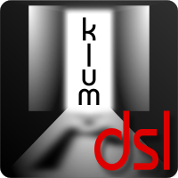

[](https://travis-ci.org/klum-dsl/klum-ast)

# Welcome to KlumAST

[](https://github.com/klum-dsl/klum-ast)


# Breaking changes since 0.17

There are some breaking changes, please take a look at the [Wiki](https://github.com/klum-dsl/klum-ast/wiki/Migration)


Turn your models into supermodels!

# What is KlumAST?

KlumAST is the first part of the KlumDSL suite. It provides and easy way to create a complete DSL for a simple model class.
 
There are two main objectives for this project:

- be as terse as possible while still being readable and using almost no boilerplate code

- Offer as much IDE-based assistance as possible. 
    - In IDEA this works by including a custom gdsl file (mostly working)
    - In Eclipse, inclusion of a custom dsld file is planned

## Example

Given the following config classes:

```groovy
@DSL
class Config {
    Map<String, Project> projects
    boolean debugMode
    List<String> options
}

@DSL
class Project {
    @Key String name
    String url
    MavenConfig mvn
}

@DSL
class MavenConfig {
    List<String> goals
    List<String> profiles
    List<String> cliOptions
}
```

A config object can be created with the following dsl:

```groovy
def github = "http://github.com"


def config = Config.create {

    debugMode true
    
    options "demo", "fast"
    option "another"
    
    projects {
        project("demo") {
            url "$github/x/y"
            
            mvn {
                goals "clean", "compile"
                profile "ci"
                profile "!developer"
                
                cliOptions "-X -pl :abc".split(" ")
            }
        }
        project("demo2") {
            url "$github/a/b"
            
            mvn {
                goals "compile"
                profile "ci"
            }
        }
    }
}
```

Find more details on in our brand new [wiki](https://github.com/klum-dsl/klum-ast/wiki)
