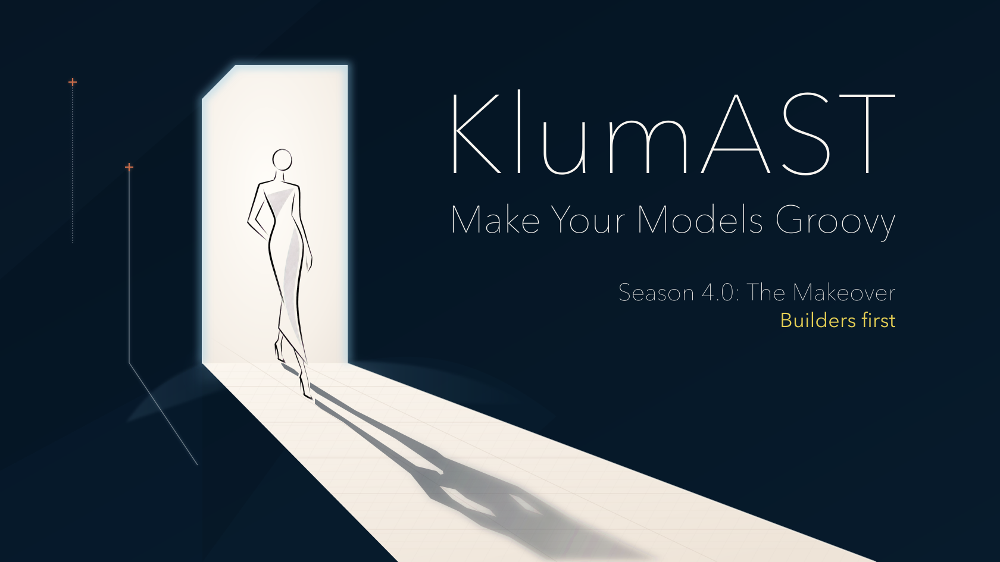

[](https://github.com/klum-dsl/klum-ast/actions/workflows/ci.yml)

Welcome to KlumAST
==================
Make Your Models Groovy!




# Breaking changes and version overview

KlumAST 4.0.0 is the released Builder-first version. Generated factories configure Builders, materialize structurally
immutable completed DSL Objects, then validate them. Start with the stable
[4.0.0 documentation](https://klum-dsl.github.io/klum-ast/4.0.0/) and the
[Builder First Migration guide](https://klum-dsl.github.io/klum-ast/4.0.0/Builder-First-Migration/) when upgrading an
existing Schema, client, or extension.

KlumAST requires Java 17 and supports Groovy 3, 4, and 5.

For 4.0 Schema projects, Groovy 4/5 support named Java modules while Groovy 3
remains classpath-only. The Gradle Schema plugin validates a user-owned
`module-info.java`; see the [canonical KlumAST documentation](https://klum-dsl.github.io/klum-ast/)
for the Gradle plugin guide and migration guidance.

Users of 1.2.0 (or lower) should take a look at the historical [Migration](https://klum-dsl.github.io/klum-ast/3.0.1/Migration/) guidance.

2.2 was the final 2.x feature release and introduced the current validation model. See
[Validation](https://klum-dsl.github.io/klum-ast/3.0.1/Validation/) and the historical sections of the migration guide.

# What is KlumAST?

KlumAST turns annotated model classes into concise, statically checked Groovy DSLs.

## Why models as code?

A useful model-as-code approach should be easy to author, clear to change, and safe to verify:

- **Automate model construction.** Generated Builders, factories, and DSL mutators remove repetitive implementation work
  while retaining statically checked Groovy source.
- **Support the authoring experience.** Generated Builder documentation and IDE mirrors make the model's construction
  surface discoverable without hand-maintained DSL stubs.
- **Validate and test the actual model.** A Schema can declare constraints, and each generated root factory runs
  validation as it materializes a completed model. Model-specific scenarios are ordinary unit tests: construct a model,
  assert its completed state or validation result, and run the same tests locally and in a pull-request build. They
  complement, rather than replace, integration tests against the eventual target.

Typical validation output names the rule that emitted it:

```text
- ERROR #ConnectivityChecks.portMustBeInRange(): port must be between 1 and 65535
```

Construction paths retain the source context, which is especially useful when a model is split across scripts. For
example, an illustrative failure from `models/production.groovy` could read:

```text
<root>.service($/Deployment.From:file(models/production.groovy)/service):
- ERROR #port: Field 'port' must be set
```

These capabilities make KlumAST especially useful for GitOps and other `*aC` (anything-as-code) workflows. Git can record a
configuration's structure, but a checked-in structure is not necessarily a verified model. Read the
[canonical KlumAST documentation](https://klum-dsl.github.io/klum-ast/) for the model-level testing rationale.

## Example

Given the following config classes:

```groovy
@DSL
class Config {
    Map<String, Project> projects
    boolean debugMode
    List<String> options
}

@DSL
class Project {
    @Key String name
    String url
    MavenConfig mvn
}

@DSL
class MavenConfig {
    List<String> goals
    List<String> profiles
    List<String> cliOptions
}
```

A config object can be created with the following dsl:

```groovy
def github = "http://github.com"


def config = Config.Create.With {

    debugMode true
    
    options "demo", "fast"
    option "another"
    
    projects {
        project("demo") {
            url "$github/x/y"
            
            mvn {
                goals "clean", "compile"
                profile "ci"
                profile "!developer"
                
                cliOptions "-X -pl :abc".split(" ")
            }
        }
        project("demo2") {
            url "$github/a/b"
            
            mvn {
                goals "compile"
                profile "ci"
            }
        }
    }
}
```

Find more details at the [KlumAST documentation entry point](https://klum-dsl.github.io/klum-ast/).
